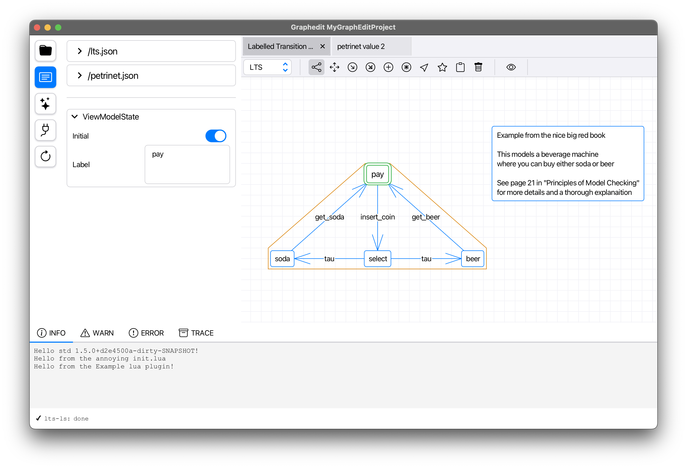

<p align="center">
   <picture>
      <source media="(prefers-color-scheme: dark)" srcset=".github/resources/logo/graphedit-logo-dark.svg">
      <source media="(prefers-color-scheme: light)" srcset=".github/resources/logo/graphedit-logo-light.svg">
      
   </picture>
</p>

<p align="center">
   Graphedit is an application for visualising, creating, editing and debugging graph-based syntaxes
</p>

------

## Build
The project is compiled using `gradle` but for the lazy ones we provide a simple `Makefile`:
```shell
# Compile and start the editor
make run
```

## Install
```shell
# TODO: figure out how we are going to distribute this
```

## Showcase
<div style="display: flex;" align="center">
  
  
</div>

## Architecture
Graphedit is designed from the ground up to be easy to extend with an opinionated, but easy to understand and efficient architecture.
Note that at the time of writing a plugin-system is planned, but not implemented yet. So extensions must be done via PRs at the moment.

### Model View Viewmodel
This project is strongly influenced by the [MVVM (Model View ViewModel)](https://en.wikipedia.org/wiki/Model–view–viewmodel) design pattern and the classes and packages are named appropriately so.
 
### Core
Includes all the core functionality for Graphedit. This includes all the views, viewmodels, models and all the associtated business logic such as serializers and various tooling.

### Graphedit
The primary entrypoint for the default application. Doesn't do much other than start.

